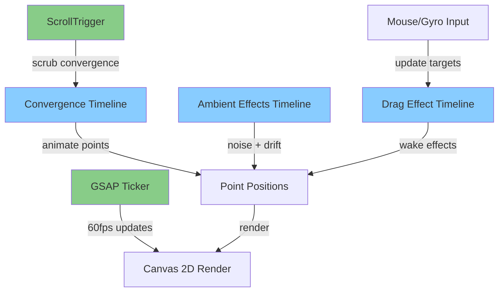

# GSAP-Native Line Field Animation Refactor

## Overview

Transform the current custom WebGL/Canvas implementation into a GSAP-powered animation system. This refactor will replace manual physics calculations and easing with GSAP's robust animation engine, providing better maintainability and leveraging GSAP's optimized performance.

## Key Changes

### 1. Rendering Engine Decision

**Recommended: Canvas 2D + GSAP**

- Keep the existing Canvas 2D fallback as the primary renderer
- Remove custom WebGL shaders (GSAP doesn't provide native WebGL primitives)
- GSAP will animate the point positions; Canvas 2D will render them
- Simpler, more maintainable, still performant for this use case

**Alternative: Three.js + GSAP** (if 3D effects desired in future)

- Would require significant additional architecture
- Overkill for 2D line animation

### 2. Core GSAP Integration

**Replace:**

- Custom `requestAnimationFrame` loop → **GSAP Ticker**
- Manual easing (`easeFactor`) → **GSAP's built-in easing functions**
- Manual interpolation → **GSAP tweens**
- Custom scroll calculations → **ScrollTrigger plugin**
- Physics-based movement → **GSAP timelines with modifiers**

### 3. Architecture Changes




### 4. Detailed Implementation Plan

#### Phase 1: GSAP Setup & Dependencies

- Add GSAP core library (v3.12+)
- Add ScrollTrigger plugin
- Add MotionPathPlugin (for smooth curves)
- Optional: Add CustomEase, DrawSVGPlugin if needed

#### Phase 2: Replace Animation Loop

**File:** [`src/Homepage/index.html`](src/Homepage/index.html)Replace the current `requestAnimationFrame` loop (line 908-952) with:

```javascript
// Use GSAP's ticker for render loop
gsap.ticker.add(render);

function render() {
  if (isPaused) return;
  
  // Canvas clear and render
  ctx.fillStyle = bgColor;
  ctx.fillRect(0, 0, width, height);
  
  // Draw lines (point positions updated by GSAP tweens)
  lines.forEach(line => drawLine(line.points));
}
```


#### Phase 3: ScrollTrigger for Convergence

Replace manual scroll progress calculation (currently at lines 159-162 in docs) with:

```javascript
const convergenceTimeline = gsap.timeline({
  scrollTrigger: {
    trigger: "body",
    start: "top top",
    end: `+=${CONFIG.scrollConvergeDistance}%`,
    scrub: 1, // Smooth scrubbing
    onUpdate: (self) => {
      const progress = self.progress;
      updateConvergence(progress);
    }
  }
});

function updateConvergence(scrollProgress) {
  // Animate each line's points toward vanishing point
  // Using staggered delays for outer lines
  lines.forEach((line, lineIndex) => {
    const horizontalDist = Math.abs(line.normalizedX - 0.5) * 2;
    const staggerDelay = horizontalDist * 0.4;
    const staggeredProgress = Math.max(0, (scrollProgress - staggerDelay) / (1 - staggerDelay));
    
    line.points.forEach((point, pointIndex) => {
      const rest = line.restPoints[pointIndex];
      const verticalProgress = rest.normalizedY;
      const curveFactor = Math.pow(verticalProgress, 1.2);
      const convergeFactor = staggeredProgress * curveFactor;
      
      // GSAP animates to converged position
      gsap.to(point, {
        x: rest.x + (vanishingPoint.x - rest.x) * convergeFactor,
        y: rest.y + (vanishingPoint.y - rest.y) * convergeFactor,
        duration: 0.1, // Fast response to scroll
        ease: "none" // ScrollTrigger scrub handles easing
      });
    });
  });
}
```


#### Phase 4: Ambient Effects with GSAP Timelines

Replace Perlin noise + drift calculations (lines 663-694) with GSAP:

```javascript
function createAmbientTimeline() {
  const tl = gsap.timeline({ repeat: -1 });
  
  lines.forEach((line, i) => {
    line.points.forEach((point, j) => {
      const rest = line.restPoints[j];
      
      // Create looping drift animation
      tl.to(point, {
        x: `+=${CONFIG.driftAmplitude}`,
        y: `+=${CONFIG.driftAmplitude * 0.3}`,
        duration: 2 + Math.random() * 2,
        ease: "sine.inOut",
        yoyo: true,
        repeat: -1,
        modifiers: {
          x: (x) => {
            // Add noise modifier
            const noiseVal = noise(
              line.normalizedX * 3 + Date.now() * CONFIG.noiseTimeScale,
              rest.normalizedY * 2
            );
            return parseFloat(x) + noiseVal * CONFIG.noiseAmplitude;
          }
        }
      }, i * 0.01); // Slight stagger
    });
  });
  
  return tl;
}
```


#### Phase 5: Interactive Drag Effects

Replace manual velocity tracking and drag calculations (lines 699-726) with GSAP:

```javascript
function handleMouseMove(e) {
  const mouseX = e.clientX;
  const mouseY = e.clientY;
  
  lines.forEach(line => {
    line.points.forEach(point => {
      const dx = point.x - mouseX;
      const dy = point.y - mouseY;
      const distSquared = dx * dx + dy * dy;
      
      if (distSquared < CONFIG.wakeLengthSquared) {
        const dist = Math.sqrt(distSquared);
        const distFalloff = Math.pow(1 - dist / CONFIG.wakeLength, 2);
        const strength = CONFIG.baseStrength * distFalloff;
        
        // GSAP animates the drag effect
        gsap.to(point, {
          x: `+=${(dx / dist) * strength}`,
          y: `+=${(dy / dist) * strength * 0.4}`,
          duration: 0.3,
          ease: "power2.out"
        });
      }
    });
  });
}
```


#### Phase 6: Spring Physics with GSAP

Replace manual spring calculations (lines 732-749) with GSAP's built-in spring easing:

```javascript
function updatePointPosition(point, targetX, targetY) {
  gsap.to(point, {
    x: targetX,
    y: targetY,
    duration: 0.5,
    ease: "elastic.out(1, 0.3)", // Spring effect
    overwrite: "auto" // Allow multiple tweens to blend
  });
}
```


#### Phase 7: Remove WebGL Entirely

- Delete WebGL shader code (lines 338-426)
- Delete tessellation function (lines 782-793)  
- Remove WebGL rendering function (lines 854-906)
- Keep only Canvas 2D rendering path (lines 833-851)

#### Phase 8: Gyroscope Integration

Keep gyroscope handling largely the same, but update targets via GSAP:

```javascript
function handleDeviceOrientation(e) {
  // ... existing calibration code ...
  
  // Instead of directly setting targetMouse, use GSAP
  gsap.to(targetMouse, {
    x: gyroTarget.x,
    y: gyroTarget.y,
    duration: 0.3,
    ease: "power2.out"
  });
}
```


### 5. Benefits of This Refactor

✅ **Simpler Code**: Remove ~500 lines of custom WebGL and physics✅ **Better Maintainability**: Declarative GSAP animations vs. imperative math✅ **Built-in Optimization**: GSAP handles frame rate, easing, and performance✅ **Easier Debugging**: GSAP DevTools for visualizing timelines✅ **ScrollTrigger**: Robust scroll handling with built-in scrubbing✅ **Flexibility**: Easy to add new animations via timelines

### 6. Performance Considerations

- GSAP Ticker runs at 60fps by default (same as current RAF)
- Canvas 2D may be slightly slower than WebGL for many lines, but:
- Still performant for ~200-280 lines (current range)
- Simpler architecture worth minor performance trade-off
- Can optimize with OffscreenCanvas if needed

### 7. Breaking Changes

- **None**: Visual output will remain identical
- Same fallback behavior for devices without capabilities
- All existing features preserved (mouse, touch, gyroscope, scroll)

### 8. Files to Modify

Primary file: [`src/Homepage/index.html`](src/Homepage/index.html)

- Add GSAP CDN links or npm packages
- Replace render loop with GSAP ticker
- Replace scroll calculations with ScrollTrigger
- Replace physics with GSAP timelines
- Remove WebGL code paths

## Implementation Steps

1. Add GSAP library and plugins
2. Replace requestAnimationFrame with gsap.ticker
3. Implement ScrollTrigger for convergence
4. Convert ambient effects to GSAP timelines
5. Convert drag effects to GSAP tweens
6. Remove WebGL code